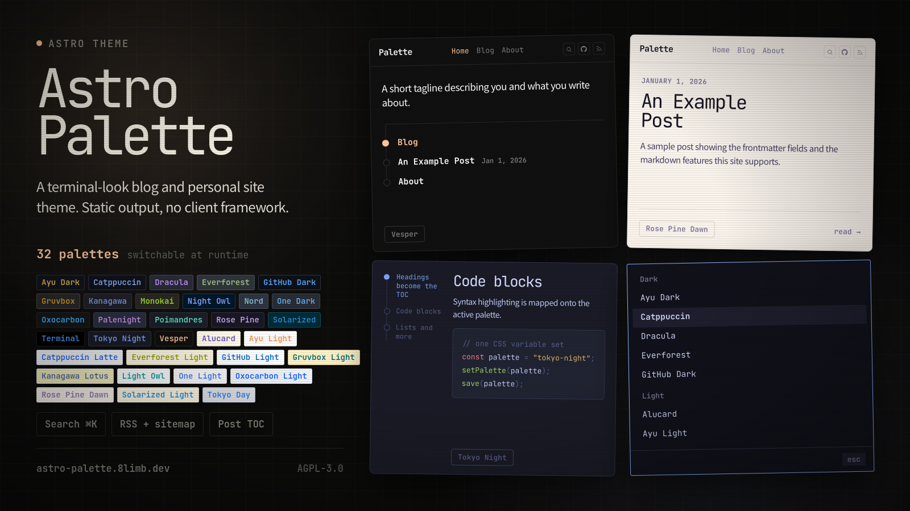
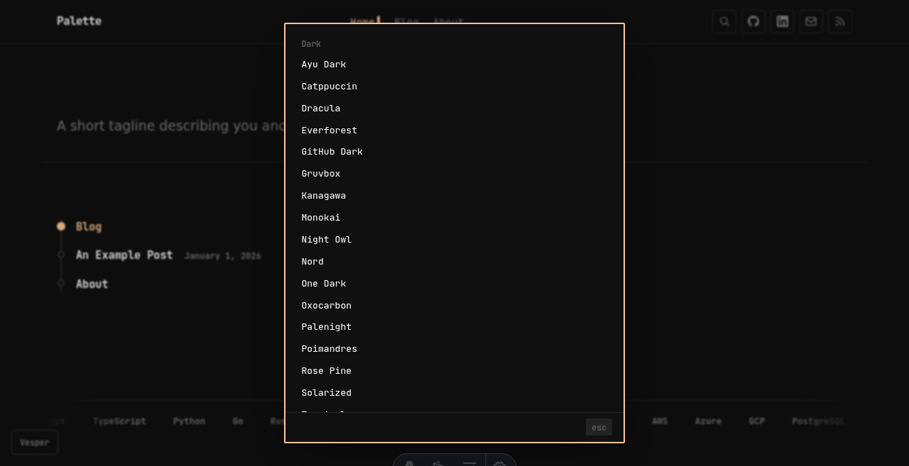

# Astro Palette

A blog and personal site theme for Astro with a terminal look and 32 switchable color palettes. The build output is fully static, with no client-side framework and no analytics.

**[Demo](https://astro-palette.8limb.dev/)**

## Screenshots




| Blog index | About |
| --- | --- |
|  |  |

| Theme switcher | Search (Ctrl/Cmd+K) |
| --- | --- |
|  |  |

## Features

- [32 color palettes](#palettes), defined as plain CSS variables and switchable at runtime
- Home, blog, and about pages, an RSS feed, and a sitemap
- A browsable `/tags/` archive, and tag chips on posts
- Client-side search via [Pagefind](https://pagefind.app), opened with Ctrl/Cmd+K, with shell-style history recall on the arrow keys
- Table of contents on posts, generated from level-two headings
- Optional [Remark42](https://remark42.com) comments
- JetBrains Mono throughout, with code blocks highlighted to match the active palette

## Palettes

Open the switcher with the pill in the bottom-left corner, which shows the active palette's name. Palettes are grouped dark and light, alphabetical within each group. Arrow keys preview a palette live, Enter commits it, and Escape reverts to the previous one. The choice is saved to `localStorage`; with nothing saved, the palette follows `prefers-color-scheme` (Vesper when dark, Rose Pine Dawn when light).

**Dark (19)** — Ayu Dark, Catppuccin, Dracula, Everforest, GitHub Dark, Gruvbox, Kanagawa, Monokai, Night Owl, Nord, One Dark, Oxocarbon, Palenight, Poimandres, Rose Pine, Solarized, Terminal, Tokyo Night, Vesper

**Light (13)** — Alucard, Ayu Light, Catppuccin Latte, Everforest Light, GitHub Light, Gruvbox Light, Kanagawa Lotus, Light Owl, One Light, Oxocarbon Light, Rose Pine Dawn, Solarized Light, Tokyo Day

The palette a first-time visitor sees is set in `src/lib/palette.ts` — one entry for `prefers-color-scheme: dark`, one for light. Both the pre-paint script and the switcher read it, so changing it there is enough.

Colors are taken from each scheme's published palette rather than sampled from screenshots. Code blocks follow the active palette: `astro.config.mjs` sets Shiki's `css-variables` theme, and the `--astro-code-*` variables are mapped onto the palette in `style.css`.

To add one, define a `[data-palette="your-name"]` block in `public/css/style.css` alongside the others, and add a matching `<button role="option" data-value="your-name">` to the switcher list in `src/components/Layout.astro`. The switcher builds itself from those buttons, so nothing else needs wiring. A block sets 20 variables — background and surface tones, four text weights, two border weights, four accents, and the terminal tones; copy an existing block of the same lightness as a starting point. Dark palettes also need their name adding to the `--logo-filter` rule that inverts the logo.

## Getting started

```sh
npm install
npm run dev       # dev server on :4321
npm run build     # astro build + pagefind index
npm run preview   # preview the production build
npm run check     # astro type checking
```

Search queries the Pagefind index in `dist/`, so run `npm run build` once before search will return results in dev.

## Customizing

The theme ships with placeholder values. Search the project for `example.com`, `Your Name`, `your-username`, and the `Palette` site name, and replace them in:

- `astro.config.mjs`: the `site` domain
- `src/components/Layout.astro`: site name, social links, footer
- `src/pages/index.astro`: tagline and person schema
- `src/pages/about.astro`: bio and education
- `src/lib/tags.ts`: skills list for the marquee, which also seeds the `/tags/` archive
- `src/lib/palette.ts`: the palette applied before a visitor picks one, per `prefers-color-scheme`
- `src/pages/rss.xml.ts` and `src/pages/blog/[slug].astro`: feed and author metadata
- `public/robots.txt` and `public/.well-known/security.txt`: domain and contact
- `public/assets/og.png`: social preview image, 1200x630 (a plain placeholder is included)

Comments stay disabled unless you run a Remark42 instance. The configuration is at the bottom of `src/pages/blog/[slug].astro`; remove the comments section there if you don't want it.

## Writing posts

Posts are markdown files in `src/content/blog/` with `title`, `description`, `date`, optional `tags`, and optional `draft` frontmatter. Each tag links to its archive page under `/tags/`. `example-post.md` shows the frontmatter and the supported markdown.

## Project structure

```
src/
  components/     Layout (nav, search, theme switcher), TypedLede, SkillsMarquee
  content/blog/   posts as markdown
  lib/            post and tag helpers, skills list, default palette
  pages/          index (home), blog/, tags/, about, 404, rss
public/
  css/style.css   all styling, including palette definitions
  assets/         font, og image
```

## License

[AGPL-3.0-or-later](LICENSE).

With thanks to:

- [herdr](https://github.com/ogulcancelik/herdr) by Oğulcan Çelik, the website theme this one grew out of, and the reason it is AGPL-3.0-or-later
- Palettes, each from its upstream project and used under that project's licence:
  [Catppuccin](https://github.com/catppuccin/palette),
  [Tokyo Night](https://github.com/enkia/tokyo-night-vscode-theme),
  [Dracula and Alucard](https://github.com/dracula/dracula-theme),
  [Nord](https://github.com/nordtheme/nord),
  [Gruvbox](https://github.com/morhetz/gruvbox),
  [One Dark and One Light](https://github.com/atom/one-dark-syntax),
  [Solarized](https://github.com/altercation/solarized),
  [Kanagawa](https://github.com/rebelot/kanagawa.nvim),
  [Rose Pine](https://github.com/rose-pine/neovim),
  [Vesper](https://github.com/raunofreiberg/vesper),
  [Everforest](https://github.com/sainnhe/everforest),
  [Ayu](https://github.com/ayu-theme/ayu-colors),
  [GitHub](https://github.com/primer/github-vscode-theme),
  [Monokai](https://github.com/tanvirtin/monokai.nvim),
  [Night Owl and Light Owl](https://github.com/sdras/night-owl-vscode-theme),
  [Oxocarbon](https://github.com/nyoom-engineering/oxocarbon),
  [Poimandres](https://github.com/drcmda/poimandres-theme) and
  [Palenight](https://github.com/whizkydee/vscode-palenight-theme).
  All are MIT except Gruvbox, which declares MIT/X11 in its README. Terminal is not
  derived from a published scheme.
- Font: [JetBrains Mono](https://www.jetbrains.com/lp/mono/), under the [SIL Open Font License 1.1](https://github.com/JetBrains/JetBrainsMono/blob/master/OFL.txt)
- Search: [Pagefind](https://pagefind.app) (MIT)
